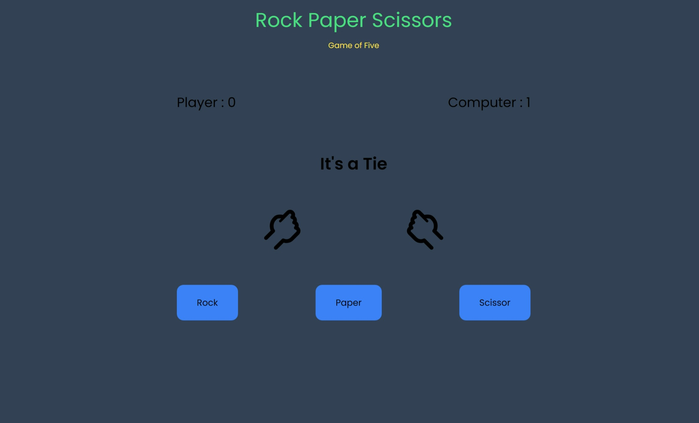

<div align="center">
<h3 align="center">Rock Paper Scissors Game</h3>
      
  <br />

  <!-- <div>
    
  </div> -->
</div>

## 📋 <a name="table">Table of Contents</a>

1. 🤖 [Introduction](#introduction)
2. ⚙️ [Tech Stack](#tech-stack)
3. 🔋 [Features](#features)
4. 🤸 [Quick Start](#quick-start)
5. 🕸️ [Snippets](#snippets)

## <a name="introduction">🤖 Introduction</a>

Welcome to the Rock Paper Scissors game! Test your luck and strategy against the computer.

## <a name="tech-stack">⚙️ Tech Stack</a>

- HTML
- JavaScript
- Tailwind CSS


## <a name="features">🔋 Features</a>

👉 **Interactive UI**: User-friendly interface with buttons for each choice (rock, paper, scissors).

👉 **Random Computer Choices**: The computer makes a random choice each round, providing a fair challenge.

👉 **Round-based Play**: Play multiple rounds to determine the overall winner.

👉 **Responsive Design**: The game is styled using Tailwind CSS to look good on various screen sizes.

## <a name="quick-start">🤸 Quick Start</a>

Follow these steps to set up the project locally on your machine.

**Prerequisites**

Make sure you have the following installed on your machine:

- A modern web browser (e.g., Chrome, Edge).
- liveserver extension for `VS code` users.


**Cloning the Repository**

```bash
git clone https://github.com/Aditya10403/RockPaperScissor.git
cd RockPaperScissor
```

**Running the Project**

- run with `liveserver` 

- open [http://127.0.0.1:5501/](http://127.0.0.1:5501/) in your browser to view the project.

**How to Play**

👉 Choose either rock, paper, or scissors by clicking the corresponding button.

👉 The computer will also make a choice.

👉 The game will display the result of the round.

👉 Play five rounds to determine the ultimate winner.

## <a name="snippets">🕸️ Snippets</a>

<details>
<summary><code>animation.css</code></summary>

```css
@keyframes shakePlayer {
  0% {
    transform: rotate(45deg) translateY(0px);
  }
  15% {
    transform: rotate(90deg) translateY(-20px);
  }
  25% {
    transform: rotate(45deg) translateY(0px);
  }
  35% {
    transform: rotate(90deg) translateY(-20px);
  }
  50% {
    transform: rotate(45deg) translateY(0px);
  }
  65% {
    transform: rotate(90deg) translateY(-20px);
  }
  75% {
    transform: rotate(45deg) translateY(0px);
  }
  85% {
    transform: rotate(90deg) translateY(-20px);
  }
  100% {
    transform: rotate(45deg) translateY(0px);
  }
}
@keyframes shakeComputer {
  0% {
    transform: rotate(-45deg) scaleX(-1) translateY(0px);
  }
  15% {
    transform: rotate(-90deg) scaleX(-1) translateY(-20px);
  }
  25% {
    transform: rotate(-45deg) scaleX(-1) translateY(0px);
  }
  35% {
    transform: rotate(-90deg) scaleX(-1) translateY(-20px);
  }
  50% {
    transform: rotate(-45deg) scaleX(-1) translateY(0px);
  }
  65% {
    transform: rotate(-90deg) scaleX(-1) translateY(-20px);
  }
  75% {
    transform: rotate(-45deg) scaleX(-1) translateY(0px);
  }
  85% {
    transform: rotate(-90deg) scaleX(-1) translateY(-20px);
  }
  100% {
    transform: rotate(-45deg) scaleX(-1) translateY(0px);
  }
}

```

</details>
<details>
<summary><code>assets</code></summary>

[icons](/icons/)

</details>


## <a>🚨 Disclaimer</a>

This documentation provides a comprehensive overview of your Rock Paper Scissors game, including how to play, the tech stack used, key features, quick start guide with prerequisites, cloning instructions, and steps to run the project, along with some example code snippets.

#

